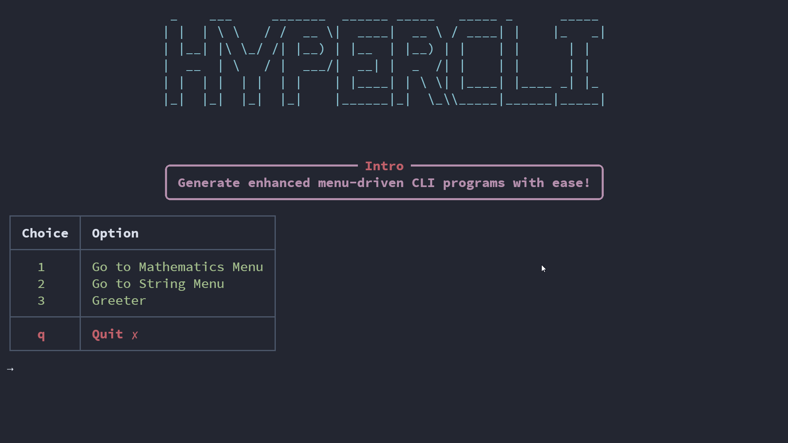

```
 _                               _ _
| |                             | (_)
| |__  _   _ _ __   ___ _ __ ___| |_
| '_ \| | | | '_ \ / _ \ '__/ __| | |
| | | | |_| | |_) |  __/ | | (__| | |
|_| |_|\__, | .__/ \___|_|  \___|_|_|
        __/ | |
       |___/|_|               v 0.2.0
```

# hypercli

**hypercli** is a Python package that provides an elegant solution for interacting with command line tools. It offers a menu-based command line interface (CLI) that allows users to navigate through different options and execute functions based on their choices.

## Features

- Interactive menu-based CLI
- Customizable banners and intros
- Support for different visual styles and colors
- Easy integration with existing Python scripts

## Installation

You can install **hypercli** using pip. Open your terminal and run the following command:

```
pip install hypercli
```

## Usage

To use **hypercli**, import the `cli` module from the `hypercli` package and create an instance of the `cli` class. You can then define your menus, options, and functions to be executed. Finally, call the `show_cli()` method to start the CLI interface.

Here's an example of how to use **hypercli**:

```python
from hypercli import cli
import webbrowser

def author_name():
    print("HYP3R00T")

def open_website():
    webbrowser.open("https://hyperoot.dev")

def greet(name):
    print(f"Hello, {name}!")

hyper = cli()

hyper.create_banner("hypercli")
hyper.create_intro("Intro", "An elegant solution to interact\n with command line tools")

hyper.create_menu("Main Menu", "Enter your choice")
hyper.add_option("Main Menu", "Checkout the Sub Menu", "Sub Menu")
hyper.add_option("Main Menu", "Greet", greet, "John")
hyper.add_option("Main Menu", "Print Author Name", author_name)

hyper.create_menu("Sub Menu", "Enter your choice")
hyper.add_option("Sub Menu", "Go Back to Main Menu", "Main Menu")
hyper.add_option("Sub Menu", "Checkout the Website (hyperoot.dev)", open_website)

response = hyper.show_cli()
```



The above script demonstrates the usage of **hypercli**. It creates a CLI with two menus: "Main Menu" and "Sub Menu". Each menu has its own options and functions to be executed. You can customize the menus, options, and visual styles according to your requirements. To check out more complex example, refer to `Example_revamped.py`.

## License

This project is licensed under the MIT License. See the [MIT](https://choosealicense.com/licenses/mit/) file for more information.
